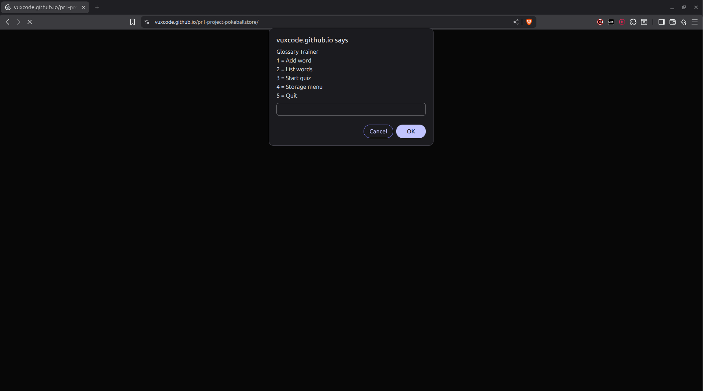

# GlossyHelper

  

## Simple offline glossary app built with JavaScript

When I started this project, I had big expectations. I wanted to build something that could store words, test translations, and maybe even save progress. Pretty soon I realised it was better to just focus on getting small things to work first, one step at a time.

GlossyHelper is a small offline glossary app I'm building in JavaScript as part of my programming and English studies. It's not fancy or big, just something I'm creating to learn more about coding and build something useful at the same time.

---

## Features (so far)

Add words in Swedish and English  
See the words list  
Test yourself in both directions (Swedish→English or English→Swedish)  
Get feedback instantly: "Correct!" or see the right answer  
Import and export word lists (paste them in, copy them out)  
Delete saved words when you need a fresh start  
Local storage - your words stay saved even after closing the browser  
Simple prompts and alerts for all interaction  
Keeps running in a loop until you choose to quit  

It's built only with the basics: prompts for input, alerts for feedback, and localStorage for saving. No fancy frameworks, no complicated setup. It's not pretty, but it works.

---

## The Menus

  

  

  

  

---

## What I'm currently working on

**Phase 8: Import function improvements**
- Need to add a check so importing 3 words (odd number) doesn't break the program
- Maybe alert the user if they paste an odd number of words

**Next small steps:**
- Clean up any remaining typos in comments and documentation

---

## Recent updates

**Storage function** - Storage function - Added a new menu that includes functions to import, export, and delete the word list.

---

## Problems solved

~~No way to save words~~ - Fixed with localStorage  
~~Export shows JSON mess~~ - Fixed by extracting just the words  
~~Import doesn't work with pasted text~~ - Fixed with split() and a loop  
~~Case sensitivity issues~~ - Fixed with toLowerCase() everywhere  
~~Syntax error breaking the program~~ - Fixed that `-` after the closing brace  

---

## Problems at the moment

**Import odd-number bug** - If you paste 3 words (or any odd number), the import breaks because it tries to make pairs. Need to add a check for this.

---

## Planned ideas for the future

- Handle synonyms properly (multiple accepted answers for one word)
- Quiz score counter (how many right/wrong in a row)
- Better list formatting (maybe not just a prompt box)
- Export to actual file download instead of just copy/paste
- Import a actual file and the program can format the words
- A interface instead of prompts. Like a terminal?
- Change the language 

*For now, I'm just happy that it finally runs without errors and does most of the things I want.*

---

## What I learned building this

**Scope** - Understanding where variables live and which functions can see them. Global vs local made sense after talking with Collin.

**localStorage** - How to save data in the browser using JSON.stringify() and JSON.parse(). The opposite operations that pack and unpack data.

**Arrays and objects** - The difference between `glossary[i]` (the whole object) and `glossary[i].swedish` (just the property). This I have a hard time to wrap my head around.

**The .split() method** - Breaking strings into arrays. "trä wood" becomes ["trä", "word"].

**The .join() method** - Combining arrays into strings. ["trä", "word"] becomes "trä word".

**The .push() method** - Adding things to the end of an array. Used it everywhere.

**The .toLowerCase() method** - Converting text to lowercase to avoid case sensitivity issues.

**Loops** - for loops with three parts: initialization, condition, increment. Used them to process word pairs.

**Modulo operator (%)** - Checking if numbers are even or odd. Perfect for validating word pairs.

**Syntax errors** - One wrong character can break everything. That `}-` taught me to look carefully.

**Stack Overflow** - Found examples of extracting values from arrays of objects. Learned that other programmers solve the same problems.

**GitHub commits** - Making small changes and committing often. Good habit for tracking progress.

**Comments** - Writing them in my own way of thinking helps me understand what the code actually does. Picking statements apart to small chunks!

---

## Technical details

Built with:
- HTML (almost nothing)
- JavaScript
- No frameworks, no libraries, just vanilla JS (plain JavaScript)
- Prompts and alerts for UI
- localStorage for data persistence

---

## Time investment

Check out [project-time-log.md](project-time-log.md) for a full breakdown.

---

## How to use it

1. Open index.html in your browser
2. Main menu appears with 5 options
3. Choose what you want to do:
   - **1 = Add word** - Type Swedish, then English
   - **2 = List words** - See all your saved words
   - **3 = Start quiz** - Test yourself (choose direction)
   - **4 = Storage menu** - Import, export, delete, or list words
   - **5 = Quit** - Exit the program
4. Your words are saved automatically in localStorage
5. Come back anytime, your words are still there

**Import format:** Paste words with spaces between them like this:  
`trä wood gräs grass vatten water`

**Export:** Copy the text from the prompt, save it somewhere, paste it back later.

---

## Final thoughts

This project taught me that programming is mostly about breaking big problems into small steps. I didn't build everything at once. I added one feature, fixed the bugs, then moved to the next thing. Sometimes even moved on without solving the bug until later.

The hardest part wasn't the coding - it was understanding what the code actually does. Comments helped. Stack Overflow helped. Talking with Collin helped. Using AI as a tutor helped. And just trying things until they worked definitely helped.

My only problem is that it feels useless, I guess that is a swedish feeling. 

---
