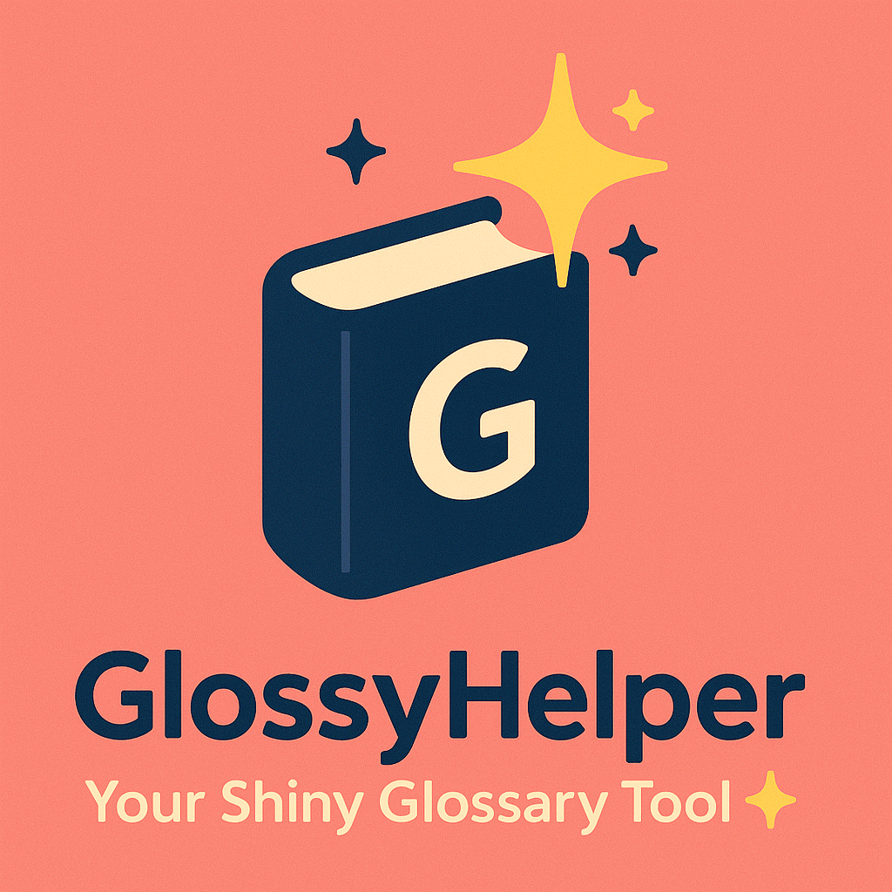

# GlossyHelper

  

## Simple offline glossary app built with JavaScript

When I started this project, I had big expectations. I wanted to build something that could store words, test translations, and maybe even save progress. Pretty soon I realised it was better to just focus on getting small things to work first, one step at a time.

GlossyHelper is a small offline glossary app I’m building in JavaScript as part of my programming and English studies.
It’s not fancy or big, just something I’m creating to learn more about coding and build something useful at the same time.

## Features (so far)

Add words in Swedish and English

Test yourself in both directions

See feedback instantly: “Correct!” or the right answer

Simple pop-ups and alerts for interaction

Keeps running in a small loop until you choose to quit

It’s built only with the basics: prompts for input, alerts for feedback, and text written directly to the page. It’s not pretty, but it works, almost.

  

## Problems at the moment
It can't display the wordlist.

## Planned ideas

Cleaner layout and design

Handling synonyms and saving data

Import and export of word lists

*For now, I’m just happy that it finally runs without (to much) errors and does most of the things i want.*