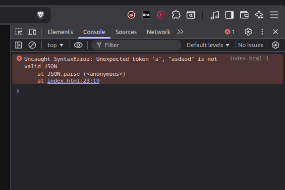
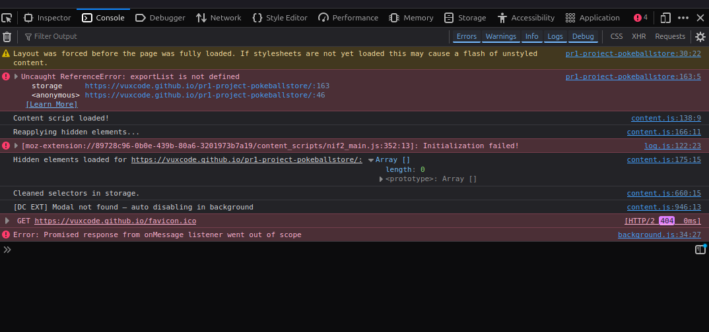

# Bug List

> Make a list of the things that don't work as expected. Keep a list of things that you have fixed and try to document how you solved them.

## 1. Problem: Displaying the word list to the user
**Issue:** I made it first with `document.write` and it created all sorts of problems.

**Solution:** I tried doing it in a prompt instead! I made an array and displayed it with a prompt and now it's working!

---

## 2. Fourth menu option not appearing after page refresh
**Issue:** I added a fourth option to the menu (local storage). When I refresh the page, it is not there.

**Solution:** GitHub Pages was just slow at updating.

---

## 3. Submenu navigation error
**Issue:** In my new submenu, I was supposed to go back to the main menu, but I accidentally set the boolean to exit the program instead.

**Solution:** Removed the boolean and added `return;`.

---

## 4. Exit message not displaying
**Issue:** Tried to add `document.write` to display "Refresh page to start GlossyHelper" when quitting the program.

**Status:** Issue documented, solution pending.

---

## 5. Import function breaks the program
**Issue:** The import function breaks the program with a syntax error in the JSON.

**Workaround:** `localStorage.removeItem("glossary");` in console will clear the storage.

**Analysis:** Maybe I need to convert the input using `JSON.stringify`. But also the words need to be added to `var eng` and `var swe`. It would be nice if it could happen automatically; otherwise, it would just be the same as the addWord function.

**Solution:** Split, for loop, and array! Now it works!

---

## 6. Uneven word count breaks the program
**Issue:** If you add an uneven number of words (for example 3 words), it breaks the program and no words are added.

**Status:** Bug identified, solution pending.

---

## 7. Export displays JSON symbols
**Issue:** Fix the export to not print JSON symbols. Parse didn't solve it.

**Status:** Bug identified. In the console you can see that the page only finds `exportList` in storage on line 163. That is the Menu. When looking through the code - was at line 208 after the curly bracket before the export function. Why doesn't VS Code give me a red line or something?