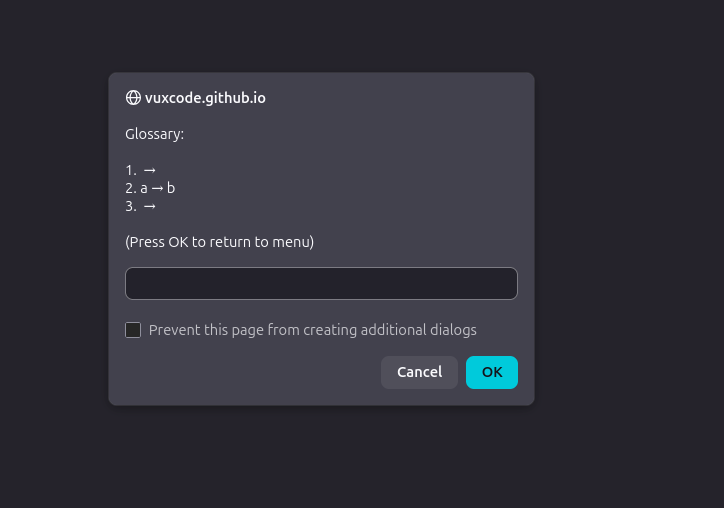

# Bug List

> Make a list of the things that don't work as expected. Keep a list of things that you have fixed and try to document how you solved them.

## 1. Problem: Displaying the word list to the user
**Issue:** I first made it using `document.write`, and it created all sorts of problems.

**Solution:** I tried doing it in a prompt instead. I made an array and displayed it with a prompt, and now it's working.

---

## 2. Fourth menu option not appearing after page refresh
**Issue:** I added a fourth option to the menu (local storage). When I refresh the page, it is not there.

**Solution:** GitHub Pages was just slow at updating.

---

## 3. Submenu navigation error
**Issue:** In my new submenu, I was supposed to go back to the main menu, but I accidentally set the Boolean to exit the program instead.

**Solution:** Removed the Boolean and added `return;`.

---

## 4. Exit message not displaying
**Issue:** Tried to add `document.write` to display “Refresh page to start GlossyHelper” when quitting the program.

**Status:** Issue documented, solution pending.

---

## 5. Import function breaks the program
**Issue:** The import function breaks the program with a syntax error in the JSON.

**Workaround:** Running `localStorage.removeItem("glossary");` in the console clears the storage.

**Analysis:** Maybe I need to convert the input using `JSON.stringify`. But the words also need to be added to `var eng` and `var swe`. It would be nice if this could happen automatically; otherwise, it would just be the same as the `addWord` function.

**Solution:** Split, for loop, and array! Now it works.

---

## 6. Uneven word count breaks the program
**Issue:** If you add an uneven number of words (for example, 3 words), it breaks the program and no words are added.

**Status:** Bug identified, solution pending.

---

## 7. Export displays JSON symbols
**Issue:** Fix the export so it does not print JSON symbols. `JSON.parse` didn’t solve it.

**Status:** Bug identified. In the console, you can see that the page only finds `exportList` in the storage function , which is the menu. When looking through the code.
Why doesn’t VS Code give me a red line or an error message?

---

## 8. Import bug
**Issue:** When showing the program in school, it felt like nothing was working. The import function was never fixed with the “three-word bug”.

**Solution:** I decided to go to GitHub and find an old commit with the first draft of the function, which kind of works if the user provides correct input.

---

## 9. Quiz wrong answer and keep-playing bug
**Issue:** During the presentation, I realized that the quiz was only designed for correct answers, and I also forgot to add `startQuiz()` after every answer.

**Solution:** Changed the correct answer check to use an array instead of a string, and added `startQuiz()` at the end of the answer check function.

---

## 10. Empty string when adding a word
**Issue:** If you press Enter instead of writing a word, it creates an empty line in the word list.

**Solution:** Updated the entire add-word logic, implemented Boolean checks, and made it easier for the user to add multiple words.
